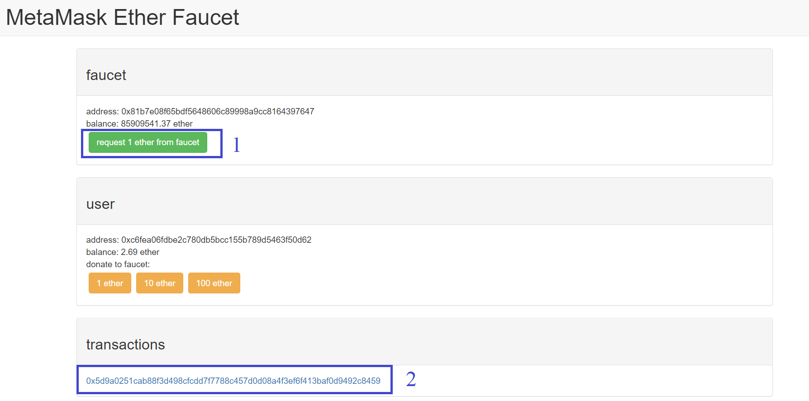

# Foundation Course in Blockchain Technology - Tools and Technology - Faucet

This page provides information on Tools and Technologies used in the <b>Foundation Course in Blockchain Technology</b>.

## Faucet 

Faucet is a service that transfers smaller units of cryptocurrency to the requested address in Testnet for development and testing purpose. Most of the 
cryptocurrency provides support to Faucet. In general, Faucet transfers a fraction or units of Test Cryptocurrency for a defined duration (say 24 hours).

### Bitcoin Faucet 

[Link](https://testnet-faucet.mempool.co/) to Bitcoin Faucet.

### Ethereum Faucet

[Link](https://faucet.metamask.io/) to Ethereum Ropsten Faucet.

In Ethereum, we will be using Ropsten Test Network. 

## Disclaimer
If there are any issues or mistakes, kindly report to admin@skillsda.com
