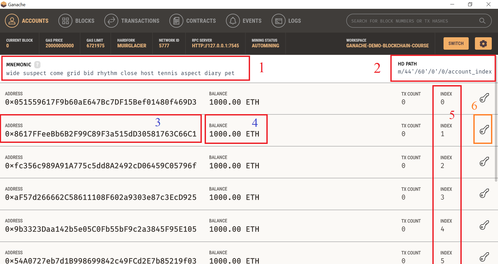
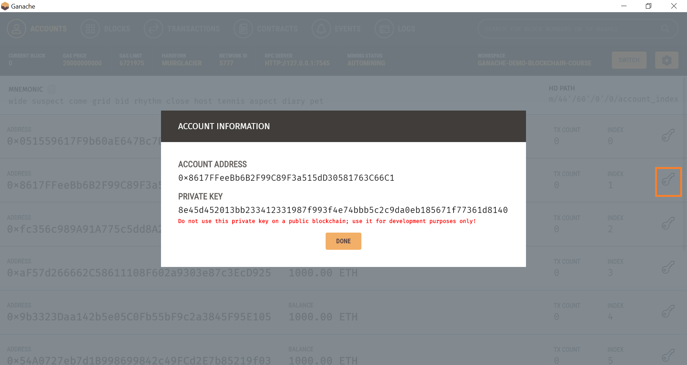

# Foundation Course in Blockchain Technology - Tools - Ganache

This page provides information on Tools and Technologies used in the <b>Foundation Course in Blockchain Technology</b>

## Ganache

Ganache is a private blockchain used for faster and independent Application Development along with Truffle Framework. Ganache has a built-in HD wallet with multiple accounts where each account has 1000 ETH, built-in Blockchain Explorer allowing user to explore the blocks, transactions, smart contracts, events, and finally Mining capability.
                                                                                                                    
Below image shows the Ganache User Interface with description on key sections in the UI.

- #1 : 12-word Mnemonic code - Seed for the Hierarchical Wallet (HD) 
- #2 : HD here refers to Hierarchical Wallet which generates multiple accounts based on single seed.
- #3 : 20-byte Ethereum Wallet Address 
- #4 : Default Balance is 100.00 ETH
- #5 : Shows multiple accounts with index starting from 0
- #6 : Private information about the account
                                                                                                                      
                                                                                                                      
Below image shows the Private Key of a user account.                                                                                                                       

## Disclaimer
If there are any issues or mistakes, kindly report to admin@skillsda.com
