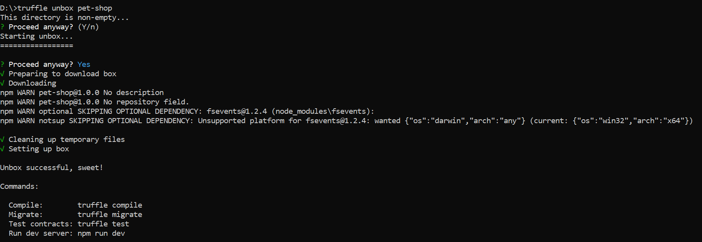
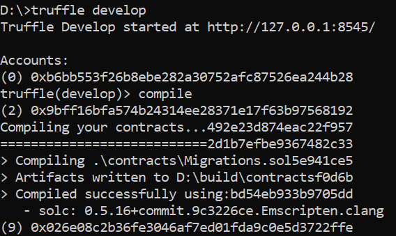
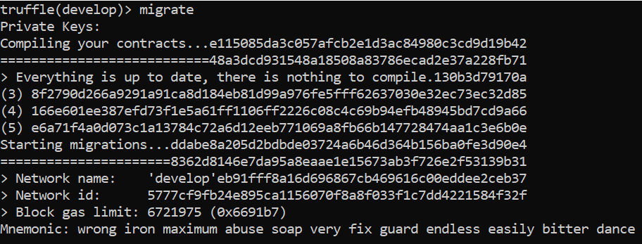
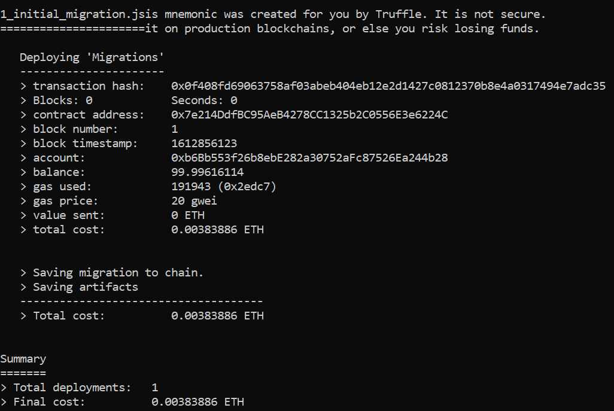
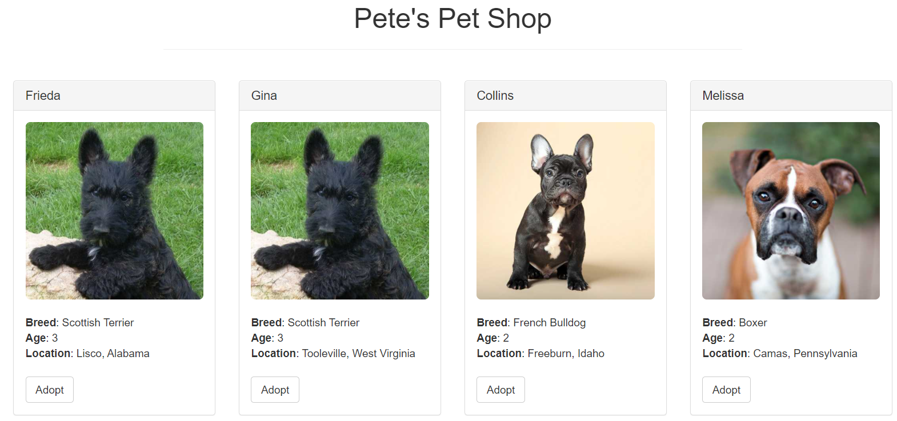

# Foundational Curriculum for Blockchain - Lab Manual & Assignment

This page provides information on Tools used in the <b>Foundational Curriculum for Blockchain</b>

## Truffle 

Truffle is a development environment, testing framework and asset pipeline for blockchains using the Ethereum Virtual Machine (EVM). Truffle can be integrated with Ganache or Metamask. 

- Installation of Truffle

  ```
  npm install -g truffle
  ```

- Unbox Tuffle Project /  Initialization of Truffle Project

  ```
  truffle unbox pet-shop  
  ```

 
 
 or 
 
 Initialize a project

  ```
  truffle init
  ```

  Once this operation is completed, you'll now have a project structure with the following items:

  - <b>contracts:</b> Solidity contracts
  - <b>migrations:</b> Scriptable deployment files
  - <b>test:</b> Test files for testing - application and contracts
  - <b>truffle-config.js:</b> Truffle configuration file
 
- Truffle Console 

  ```
  truffle develop
  ```

 
 

- Writing the Smart Contracts


- Compilation of Smart Contracts

  ```
  truffle compile
  ```
  
- Migration of Smart Contracts

  ```
  truffle migrate
  ```
  
 
 
  
- Testing Smart Contracts

  ```
  truffle test
  ```
  
- DApp 

 


## Disclaimer
If there are any issues or mistakes, kindly report to admin@skillsda.com
